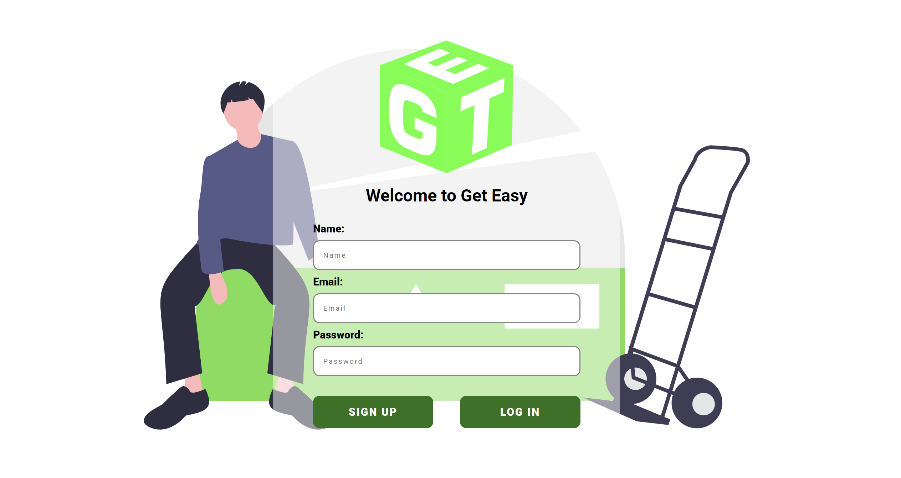

# GetEasy

GetEasy is a logistics platform that allows users to smoothly deliver shipments from Point A to Point B.

<figure>
    
</figure>

## Getting Started

### Requirements

- Google Api Key

### Root

```
npm i
```

### Server

```
cd server
```

```
npm i
```

```
npm start
```

### Client
```
cd client
```

```
npm i
```

```
npm run dev
```


## Tech Stack

- PostgreSQL, Sequelize
- Express, Express Sessions
- React, Next
- Google Maps API

## Contributors

- [Atai Ismaiilov]('https://github.com/ismaiilov-atai/')
- [Pablo Flores Fernández]('https://github.com/flores5545/')
- [Philippa Payne]('https://github.com/P-C-R-P/')
